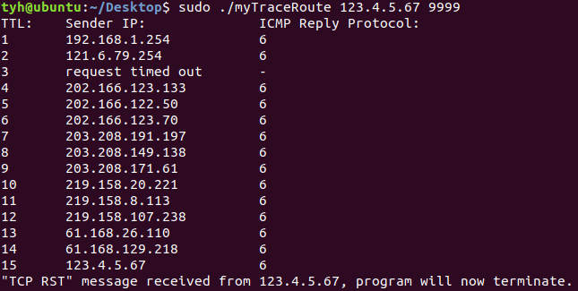
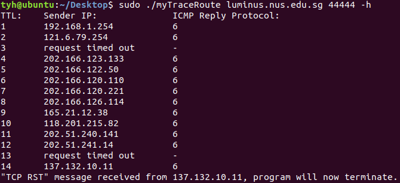

# myTraceRoute

## What is myTraceRoute?
myTraceRoute is an implementation of the traceroute tool using TCP. 
What myTraceRoute does is create three sockets - one for sending TCP SYN packets (with increasing TTL values) to a destination host, 
one for receiving ICMP packets for TTL exceeded messages (providing us with the IP address of the gateway this TCP SYN packet passed through), 
and the last one for receiving TCP RST packets (since TCP will likely get these packets instead of "Destination Port Unreachable" ICMP packets).  

By printing out the source IP addresses of ICMP messages along the way, we can trace the path the TCP SYN packets take to reach the destination host. 
The program terminates once a TCP RST packet is received from the destination host (instead of " Destination Port Unreachable" ICMP packets).


## Assumptions
When the TCP SYN packet reaches the intended destination and the port is unavailable, 
it will send a TCP RST packet rather than a Destination Port Unreachable ICMP packet.  

No other tools like tracepath or traceroute are running while using this tool.


## Development Environment
```
Linux ubuntu 5.0.0-29-generic #31~18.04.1-Ubuntu SMP Thu Sep 12 18:29:21 UTC 2019 x86_64 x86_64 x86_64 GNU/Linux
```


## Instructions
1) On your Linux terminal, compile the C++ code into a binary program.
```
g++ -o myTraceRoute myTraceRoute.cpp
```

2) In the same file directory, run the following commands as examples.
Do note that sudo is necessary to create sockets for this program.
```
sudo ./myTraceRoute 123.4.5.67 9999
sudo ./myTraceRoute luminus.nus.edu.sg 44444 -h
```

## Screenshots

Output from sudo ./myTraceRoute 123.4.5.67 9999


Output from sudo ./myTraceRoute luminus.nus.edu.sg 44444 -h